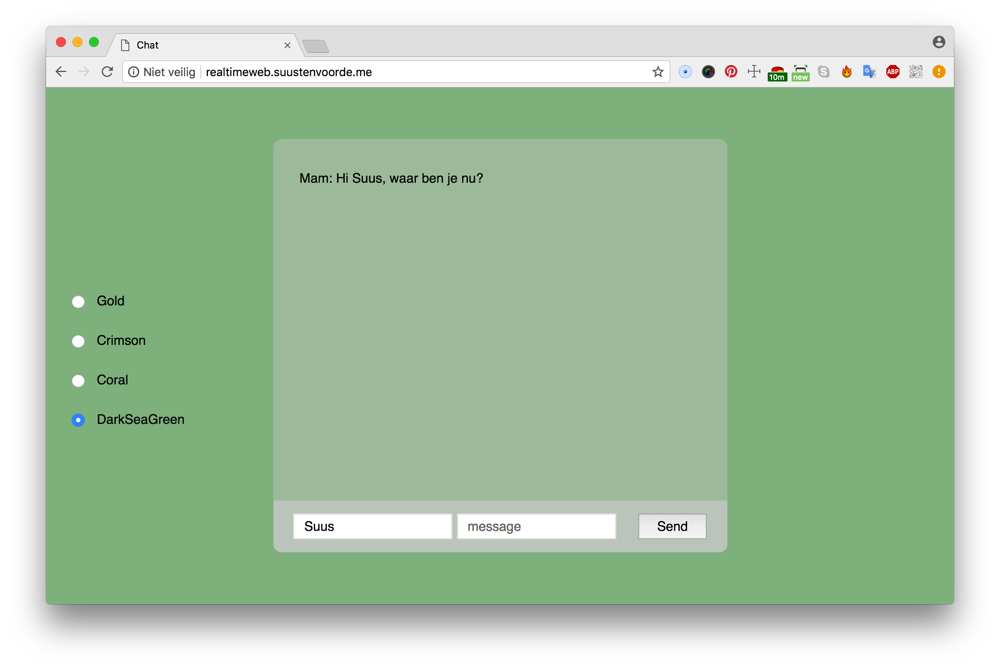
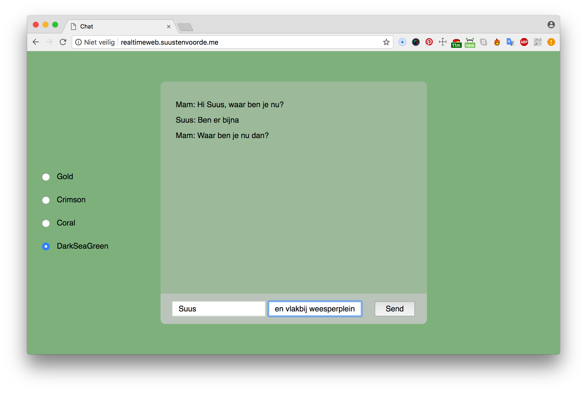
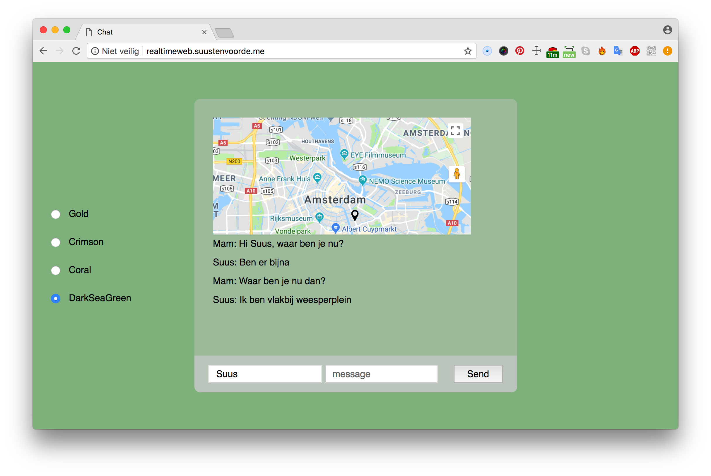
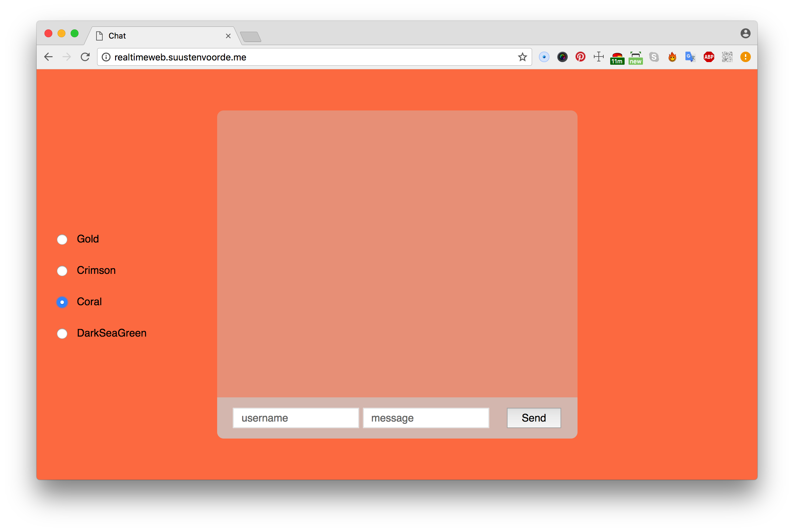

# Real-time and location-based chat application

This application is a real-time chat room. People are able to communicate with each other when they are on the same URL at the same time. Working with socket.io and create something that uses the realtime function. Refactored the jQuery [chat example](https://socket.io/get-started/chat/) to vanilla JS so that I didn't need to use the jQuery library. Start with the basic chat then add a unqiue feature to understand the workings of socket.io.

As a user you can change the background color real-time. You can fill in a username and a message that will be send to all users at the same time. Besides that, when you type in a specific location, a map will show up with a marker on that specific point.







## How to install
First of all, download or clone the project, navigate to root folder and install dependencies.

``` npm install```

Run ``` node app.js ```
(Or fix TODO 1, it will change to `npm start`)
to start the server on port 3000.

Run ``` npm start ``` to start the server on port 3000.

## Tooling
- [x] Server: express
- [x] Templating: EJS
- [x] Real-time: Socket.io

## Features
- [x] Change backgroundcolor
- [x] Fill in a username
- [x] Call a specific location and it will be showed on a map
- [x] Real-time communication



## To do
- [ ] Add a unique function to the basic chat assignment.
- [ ] Deploy the app.
- [ ] Add user names to the chat messages
- [ ] 'Optimize later....'
